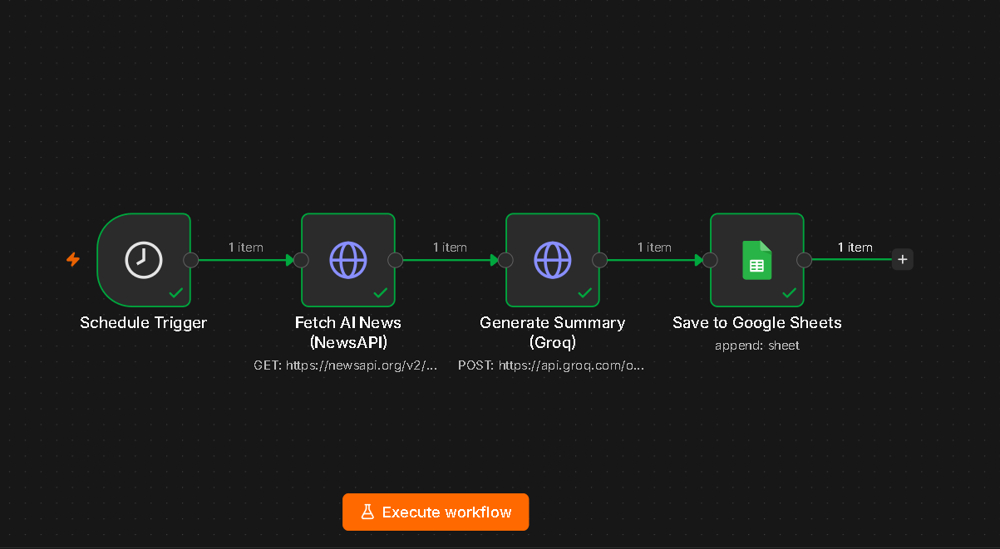
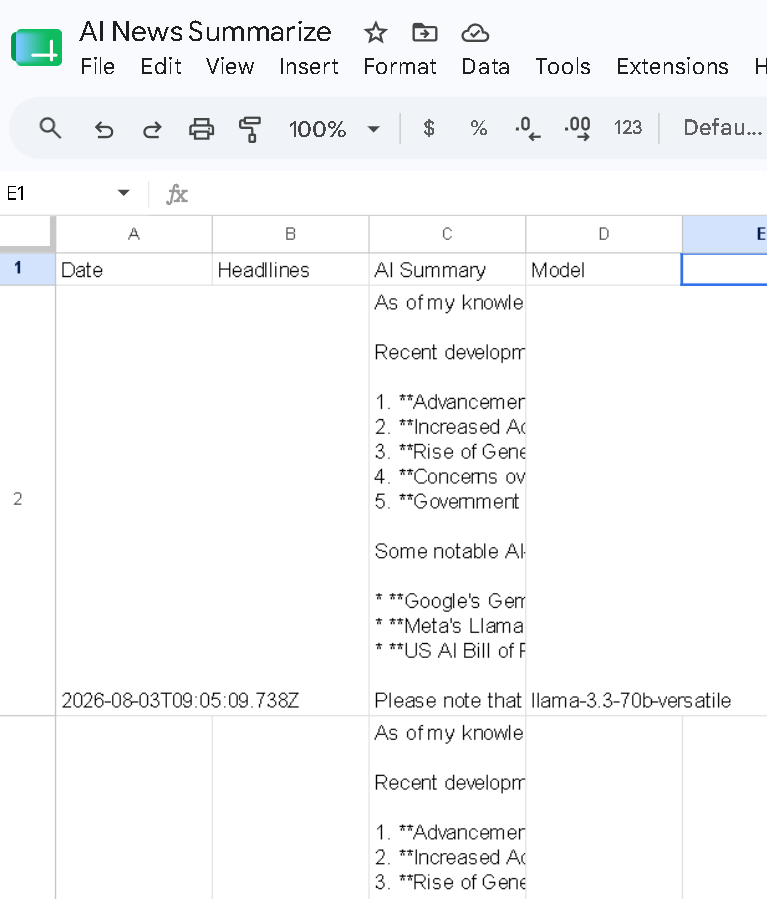

# AI News Summarizer (n8n)

An automated [n8n](https://n8n.io) workflow that runs **every morning**, fetches the latest AI news, summarizes it with Groq, and stores the results in Google Sheets.



## Features

- **Schedule Trigger** — runs automatically every morning at 08:00
- **Fetch AI News (NewsAPI)** — pulls the latest `artificial intelligence` articles (English, top 5)
- **Generate Summary (Groq)** — summarizes the day's AI news using `llama-3.3-70b-versatile`
- **Save to Google Sheets** — appends each run to your spreadsheet

Everything is connected and works automatically once configured.

## How it works

```
Schedule Trigger (daily 08:00)
        │
        ▼
Fetch AI News (NewsAPI) ────► headlines
        │
        ▼
Generate Summary (Groq) ────► AI summary + model
        │
        ▼
Save to Google Sheets ──────► Date, Headlines, AI Summary, Model, Total Articles
```

## Google Sheets output

Each run appends one row with these columns:

| Column           | Description                                        |
|------------------|----------------------------------------------------|
| Date             | Timestamp of the run (ISO 8601)                    |
| Headlines        | Titles of the fetched news articles (one per line) |
| AI Summary       | Groq-generated summary of the news                 |
| Model            | LLM used (e.g. `llama-3.3-70b-versatile`)          |
| Total Articles   | Number of articles fetched (top 5)                 |



## Requirements

- An [n8n](https://n8n.io) instance (self-hosted or cloud)
- A [NewsAPI](https://newsapi.org) API key (free tier)
- A [Groq](https://console.groq.com) API key
- A Google account with Google Sheets access (for the OAuth2 credential)

## Setup

1. **Import the workflow**
   - In n8n: *Workflows → ⋯ → Import from File* → select [`workflow/AI-News-Summarizer.json`](workflow/AI-News-Summarizer.json)
   - Or paste the JSON via *Import from Clipboard*.

2. **Add your credentials**
   - **NewsAPI key**: open the *Fetch AI News (NewsAPI)* node → Header Parameters → replace `YOUR_NEWSAPI_KEY` with your key from [newsapi.org](https://newsapi.org).
   - **Groq key**: open the *Generate Summary (Groq)* node → Header Parameters → replace `YOUR_GROQ_API_KEY` with your key from [console.groq.com](https://console.groq.com/keys).
   - **Google Sheets**: in the *Save to Google Sheets* node, connect a new *Google Sheets OAuth2* credential and replace `YOUR_SPREADSHEET_ID` with the ID of your spreadsheet (the part of the URL after `/d/`).

3. **Activate the workflow**
   - Toggle the workflow to **Active**. It will run every morning at 08:00. To run at a different time, adjust the *Schedule Trigger* node.

## Project structure

```
ai-news-summarizer-n8n/
│
├── workflow/
│   └── AI-News-Summarizer.json   # n8n workflow export
│
├── screenshots/
│   ├── workflow.png              # workflow canvas
│   └── google-sheet.png          # spreadsheet output
│
├── README.md
├── LICENSE
└── .gitignore
```

## License

[MIT](LICENSE)
